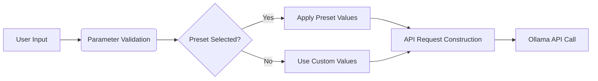

# LLM Parameter Reference Guide

## Core Parameters

### Temperature (0.1-2.0)
- Controls randomness/creativity
- Lower = more deterministic
- Higher = more diverse outputs
- Recommended: 0.7 for balanced use

### Top-p (0.1-1.0)
- Nucleus sampling threshold
- Filters low-probability tokens
- 0.9 = considers top 90% of options

### Top-k (1-100)
- Limits sampling pool size
- Lower = more predictable
- Higher = more diverse

### Max Tokens (1-8192)
- Response length limit
- Affects generation time

## Advanced Parameters

### Frequency Penalty (0-2)
- Reduces repetition
- Higher = more unique phrases

### Presence Penalty (0-2)
- Encourages new topics
- Prevents getting "stuck"

### Mirostat Mode (0-2)
- Advanced sampling algorithm
- 0=disabled, 1=mirostat, 2=mirostat 2.0

## Performance Parameters

### Num GPU Layers
- GPU acceleration depth
- Higher = more GPU utilization

### Num Threads
- CPU core allocation
- Optimize for your hardware

## Preset Recommendations

| Use Case       | Temp | Top-p | Top-k | Notes                  |
|----------------|------|-------|-------|------------------------|
| Code Generation| 0.3  | 0.95  | 40    | Precise, deterministic |
| Creative Writing| 0.9 | 0.85  | 60    | More imaginative       |
| Technical Q&A  | 0.6  | 0.9   | 50    | Balanced accuracy      |

## Visual Examples

### Parameter Effects on Output

#### Low Temperature (0.2)
```
The capital of France is Paris.
```

#### High Temperature (1.0)
```
The vibrant capital of France, Paris, 
is known for its art, culture...
```

### Preset Comparison
| Preset       | Output Characteristics          |
|--------------|----------------------------------|
| Precise      | Factual, concise, minimal fluff |
| Balanced     | Natural flow with some creativity|
| Creative     | Expressive, imaginative         |

## Technical Implementation

### Parameter Processing Flow


### Default Values
```javascript
// From parameter_controls.js
export const DEFAULT_PARAMS = {
  temperature: 0.7,
  top_p: 0.9, 
  top_k: 40,
  repeat_penalty: 1.1,
  tfs_z: 0.95
};
```

### Validation Rules
| Parameter   | Type   | Range      | Sanitization          |
|-------------|--------|------------|-----------------------|
| temperature | float  | 0.1-2.0    | Round to 1 decimal    |
| top_p       | float  | 0.1-1.0    | Clamp to range        |
| num_threads | int    | 1-12       | Match CPU cores       |

[See implementation in parameter_controls.js](static/js/parameter_controls.js)
